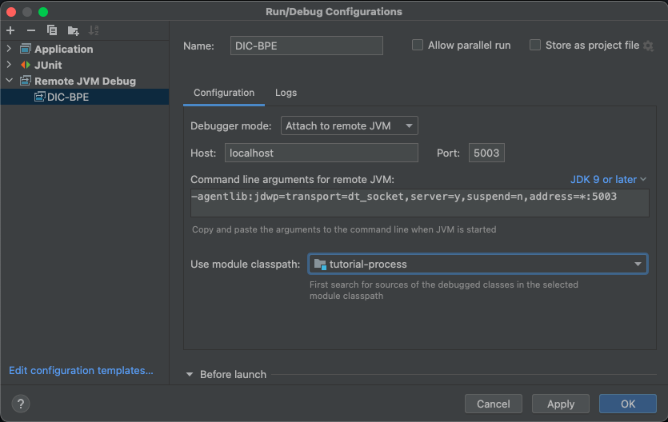

[Prerequisites](prerequisites.md) • [Exercise 0](exercise-0.md) • [Exercise 1](exercise-1.md) • **Exercise 1.1** • [Exercise 2](exercise-2.md) • [Exercise 3](exercise-3.md) • [Exercise 4](exercise-4.md) • [Exercise 5](exercise-5.md) • [Exercise 6](exercise-6.md) • [Exercise 7](exercise-7.md)
___

# Exercise 1.1 - Process Debugging
This exercise looks at how to use the Java debugger of your IDE to remotely debug the execution of a process plugin.

## Introduction
The DSF FHIR server and the DSF BPE server applications are written in Java and as such are executed on a headless JRE 21 within their docker containers. Command line arguments can be passed to the JVM inside the [ghcr.io/datasharingframework/fhir](https://github.com/datasharingframework/dsf/pkgs/container/fhir) and [ghcr.io/datasharingframework/bpe](https://github.com/datasharingframework/dsf/pkgs/container/bpe) docker images by specifying the environment variable `EXTRA_JVM_ARGS`. This can be used for example to configure the minimum and maximum heap of the JVM; but can also be used to specify a remote debugging port, which we will use in this exercise.

An `EXTRA_JVM_ARGS` environment variable is already configured for all DSF FHIR server and DSF BPE server docker containers in the tutorial docker-compose test setup. Take a look at the [docker-compose.yml](https://github.com/datasharingframework/dsf-process-tutorial/blob/main/dev-setup/docker-compose.yml) file to look up the port numbers specified for the different DSF FHIR and DSF BPE servers.

## Exercise Tasks
1. Start the DSF FHIR server for the `dic.dsf.test` organization in a console at location `.../dsf-process-tutorial/dev-setup`:
    ```
    docker-compose up dic-fhir
    ```
2. Start the DSF BPE server for the `dic.dsf.test` organization in second console at location `.../dsf-process-tutorial/dev-setup`:
    ```
    docker-compose up dic-bpe
    ```
3. Configure your Java IDE for remote debugging
    * Eclipse:  
        
    * IntelliJ:  
        

4. Create a debug breakpoint in the first line of the `DicTask` class `execute` method. 
5. Start your previously defined remote Java debugger in your IDE.
6. Execute the `TutorialExampleStarter` class to start `dsfdev_dicProcess`.
7. Use your IDE's debugger to step through the code of the `DicTask` class `execute` method.

## Hint
You can also use this technique to debug the DSF FHIR server and DSF BPE server side of the DSF by cloning the [DSF repository](https://github.com/datasharingframework/dsf) and setting up the remote debugger in that project.
You will be able to see what the DSF is doing internally when executing your process.

___
[Prerequisites](prerequisites.md) • [Exercise 0](exercise-0.md) • [Exercise 1](exercise-1.md) • **Exercise 1.1** • [Exercise 2](exercise-2.md) • [Exercise 3](exercise-3.md) • [Exercise 4](exercise-4.md) • [Exercise 5](exercise-5.md) • [Exercise 6](exercise-6.md) • [Exercise 7](exercise-7.md)
